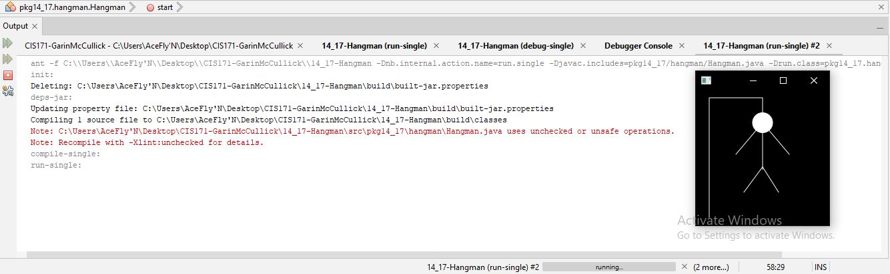

# SETUP EXAMPLE

This Project is an app that finds the largest object in an array of objects using the Comparable interface.

## Example Output

## Analysis Steps

When making this Object area sorter, I thought about the setup and how it should function. I decided that making two public classes was the direction I wanted to take as I could then instantiate the template like circle class into the GeometricObject class with the Comparable interface to filter out the largest object out of the array of objects.

### Design

How did you approach your program design? Did you use multiple classes to define various objects?
I desigined this app around two classes. A Circle class and a GeometricObject class. New objects or circles in this case are entered into the circle class as parameters from the array of objects in the GeometericObject class. From there each array object or circle is run throught the comparable interface in the circles class and then is displayed in the GeometricObject class.

### Testing / Notes

To test this app you have to change the area parameter inside Circles array inside the GeometricObject class. Changing this around is a clear and easy way to see that the app only displays the circle with the highest area among all the objects in the array.

## Do not change content below this line
## Adapted from a README Built With

* [Dropwizard](http://www.dropwizard.io/1.0.2/docs/) - The web framework used
* [Maven](https://maven.apache.org/) - Dependency Management
* [ROME](https://rometools.github.io/rome/) - Used to generate RSS Feeds

## Contributing

Please read [CONTRIBUTING.md](https://gist.github.com/PurpleBooth/b24679402957c63ec426) for details on our code of conduct, and the process for submitting pull requests to us.

## Versioning

We use [SemVer](http://semver.org/) for versioning. For the versions available, see the [tags on this repository](https://github.com/your/project/tags). 

## Authors

* **Billie Thompson** - *Initial work* - [PurpleBooth](https://github.com/PurpleBooth)

See also the list of [contributors](https://github.com/your/project/contributors) who participated in this project.

## License

This project is licensed under the MIT License - see the [LICENSE.md](LICENSE.md) file for details

## Acknowledgments

* Hat tip to anyone who's code was used
* Inspiration
* etc
