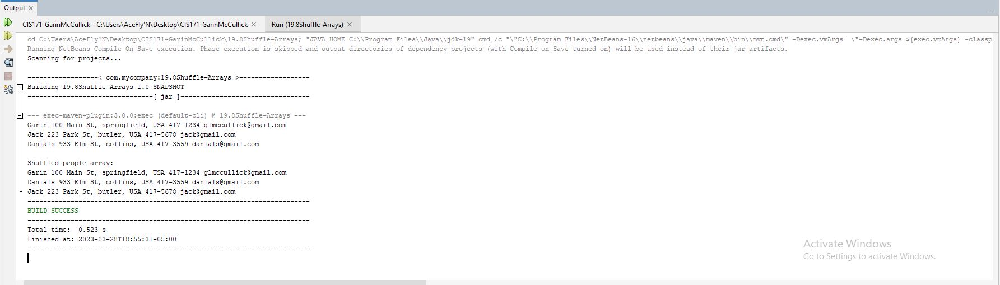

This Project is an app that uses the java maven library to create a shuffled ArrayList.

## Output

## Analysis Steps

When making this I created a class of Person, and an ArrayList of People. Where a person is an object with multiple properties and is put into an ArrayList of People.
### Design

This project allowed me to play with arrayLists and generic types inside java. This program was designed to be able to create a "person" and fetch said person from a list of "people".

### Testing / Notes

To test this application I made sure the collections.shuffle method shuffled the array list.

## Do not change content below this line
## Adapted from a README Built With

* [Dropwizard](http://www.dropwizard.io/1.0.2/docs/) - The web framework used
* [Maven](https://maven.apache.org/) - Dependency Management
* [ROME](https://rometools.github.io/rome/) - Used to generate RSS Feeds

## Contributing

Please read [CONTRIBUTING.md](https://gist.github.com/PurpleBooth/b24679402957c63ec426) for details on our code of conduct, and the process for submitting pull requests to us.

## Versioning

We use [SemVer](http://semver.org/) for versioning. For the versions available, see the [tags on this repository](https://github.com/your/project/tags). 

## Authors

* **Billie Thompson** - *Initial work* - [PurpleBooth](https://github.com/PurpleBooth)

See also the list of [contributors](https://github.com/your/project/contributors) who participated in this project.

## License

This project is licensed under the MIT License - see the [LICENSE.md](LICENSE.md) file for details

## Acknowledgments

* Hat tip to anyone who's code was used
* Inspiration
* etc
