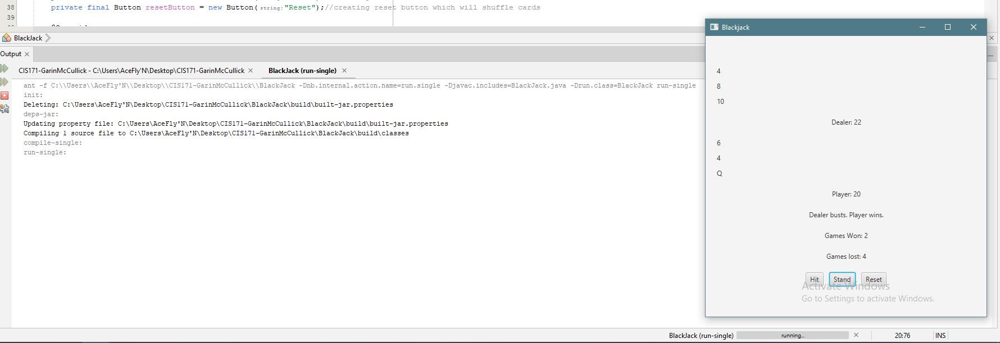

## Testing
When testing this I had to take several factors into account. I had to create win and loss conditions insuring that each condition worked correctly and could be tested. All buttons were tested, as well as making sure the reset button shuffled the cards in the deck.
## Output

## Challenges
One of the challenges that took the most ammount of time during this was figuring out how to setup the hand win/loss counters. I found that the most straight forward solution was setting up a boolean to detect if the win/loss counters had already been updated each game and then in each win/loss condition updating the boolean. Since there are several ways to win and lose without knowing if the counters had already been updated it would add by 2 or 3 instead of 1 each game.

### Design

I designed this to be simple and straight forward. There are no animations its mainly text based. I decided to allow the player to try and hit 21 even if the dealer hit 21 already. I'm not sure if thats part of the official rules but anytime I go to the casino it seems like the house wins so maybe im just trying to tip the scales in the players favor ;).
### Conclusion
This was a cool project. I love playing blackjack. This project has inspired me to try my hand at creating a poker app as thats also a card game I really enjoy. There were some challenges througout this assignment but looking back it all seems pretty straight forward knowing now what my earlier mistakes were.
## Do not change content below this line
## Adapted from a README Built With

* [Dropwizard](http://www.dropwizard.io/1.0.2/docs/) - The web framework used
* [Maven](https://maven.apache.org/) - Dependency Management
* [ROME](https://rometools.github.io/rome/) - Used to generate RSS Feeds

## Contributing

Please read [CONTRIBUTING.md](https://gist.github.com/PurpleBooth/b24679402957c63ec426) for details on our code of conduct, and the process for submitting pull requests to us.

## Versioning

We use [SemVer](http://semver.org/) for versioning. For the versions available, see the [tags on this repository](https://github.com/your/project/tags). 

## Authors

* **Billie Thompson** - *Initial work* - [PurpleBooth](https://github.com/PurpleBooth)

See also the list of [contributors](https://github.com/your/project/contributors) who participated in this project.

## License

This project is licensed under the MIT License - see the [LICENSE.md](LICENSE.md) file for details

## Acknowledgments

* Hat tip to anyone who's code was used
* Inspiration
* etc
