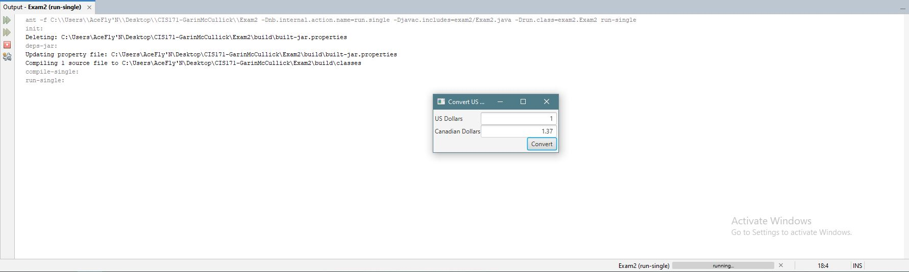

This Project is an app that uses the javafx library to create a currency converter from USD to Canadian with the exchange rate set at 1.37 or 1 usd equal to 1.37 canadian

## Output

## Analysis Steps

When making this display, I used textfields, panes, buttons, and labels as well as positioning methods.
### Design

This was a fun project. It allowed me to play with Pos properties, editable and non-editable textfields, and event handlers using try and catch.

### Testing / Notes

To test this application I worked with multiple doubles to ensure the exchange was correct I made sure that the sizing was dynamic and responsive. as well as making sure that my event handler caught any non digit or wrong formatting.

## Do not change content below this line
## Adapted from a README Built With

* [Dropwizard](http://www.dropwizard.io/1.0.2/docs/) - The web framework used
* [Maven](https://maven.apache.org/) - Dependency Management
* [ROME](https://rometools.github.io/rome/) - Used to generate RSS Feeds

## Contributing

Please read [CONTRIBUTING.md](https://gist.github.com/PurpleBooth/b24679402957c63ec426) for details on our code of conduct, and the process for submitting pull requests to us.

## Versioning

We use [SemVer](http://semver.org/) for versioning. For the versions available, see the [tags on this repository](https://github.com/your/project/tags). 

## Authors

* **Billie Thompson** - *Initial work* - [PurpleBooth](https://github.com/PurpleBooth)

See also the list of [contributors](https://github.com/your/project/contributors) who participated in this project.

## License

This project is licensed under the MIT License - see the [LICENSE.md](LICENSE.md) file for details

## Acknowledgments

* Hat tip to anyone who's code was used
* Inspiration
* etc
